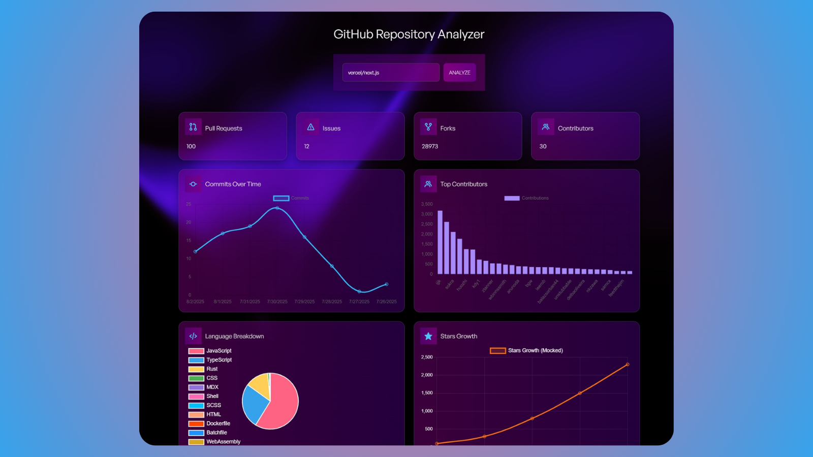

# 📊 GitHub Repository Analyzer Dashboard

A modern, dark-themed dashboard that lets you analyze GitHub repositories using beautiful, interactive charts and live data from the GitHub API. Built using **React** and **Chart.js/Recharts**, this tool helps developers and teams visualize project activity, contribution stats, and growth.

---

## 🚀 Features

- 🔍 **Search Repositories** by name or URL  
- 🌟 **Star Growth Charts**  
- 🧑‍💻 **Top Contributors Visualization**  
- 🧾 **Commit Activity Analysis**  
- 📦 **Language Usage Breakdown**  
- 🧑‍🤝‍🧑 Compare multiple repositories  
- 🖨️ Export or generate **PDF reports**  
- 🌙 Clean and responsive **Dark Theme UI**  
- 📱 Fully responsive layout (mobile/tablet/desktop)  

---

## 🖼️ Preview

 <!-- Replace with your screenshot path -->

---

## 🛠️ Tech Stack

- **Frontend**: React.js  
- **Charting**: Chart.js or Recharts  
- **Styling**: Custom CSS (Dark Mode)  
- **API**: GitHub REST API  
- **Utils**: Axios, Date-fns, FileSaver, etc.  

---

## 📦 Installation

```bash
git clone https://github.com/yourusername/github-repo-analyzer.git
cd github-repo-analyzer
npm install
npm start
```

---

## 📌 Usage

1. Enter a GitHub repo name or link (e.g., `facebook/react`)
2. Hit **Analyze** to fetch real-time stats from GitHub
3. Explore visual insights:
   - Commit activity
   - Top contributors
   - Star growth
   - Language usage
4. Compare multiple repositories side-by-side
5. Export insights as a PDF (coming soon)

---

## 🧩 Folder Structure

```
├── public/
├── src/
│   ├── components/
│   │   ├── Charts/
│   │   ├── RepoSearch/
│   │   ├── Cards/
│   ├── utils/
│   ├── App.js
│   ├── index.js
│   └── index.css  // Custom dark CSS
├── package.json
└── README.md

```


---

## 📈 Example Repositories to Try

- `vercel/next.js`
- `facebook/react`
- `microsoft/vscode`
- `openai/gpt-4`

---

## 📄 License

This project is licensed under the [MIT License](LICENSE).

---

## 👨‍💻 Author

**Aman Nayak**  
🌐 [Portfolio Website](https://amannayak.vercel.app)  
📧 [Email](mailto:amannayak2911@gmail.com)  
🐙 [GitHub](https://github.com/codinggujarat)  
💼 [LinkedIn](https://www.linkedin.com/in/amanayak/)
